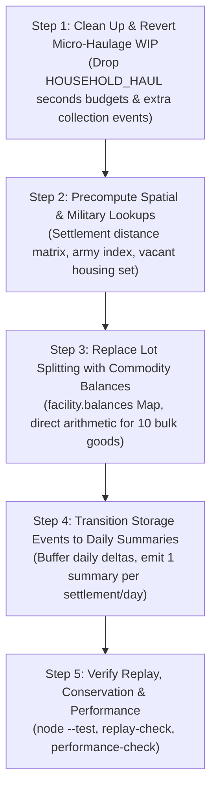

# Economic Ledger Simplification: Architecture & Refactoring Plan

**Target Audience:** Autonomous Coding Agents (Codex / Antigravity) & Maintainers  
**Context:** Simulation hot path optimization for `index.html`  
**Goal:** Eliminate processing bottlenecks and memory churn in economic simulation while preserving **100% fidelity of individual household resource tracking, hunger, starvation, assets, and customary inheritance**.

---

## 1. Executive Summary & Diagnosis

Recent optimization attempts fell into the trap of **hyper-micro-simulation bookkeeping**:
1. **The Lot-Splitting Engine (`StorageLedger`):** Fungible bulk commodities (grain, fish, wool, timber, etc.) are currently modeled as discrete individual lot tokens (`lot:local:XXXXX`). Every mouthful eaten by a peasant family splits a lot, clones state snapshots (`captureLot`), runs floating-point epsilon compensation, and emits journal events. Over **5,000,000 lot-split events (~3 GB uncompressed)** are emitted per simulated year. Later in the tick, `coalesce` runs expensive JSON-key stringifications to re-merge those identical crumbs.
2. **The Dual-Ledger Synchronization Tax:** The engine maintains both abstract legal claims (`stockOf(s, who).held`, `.sale`) and physical lots (`StorageLedger.lots`). It spends >40% of tick time running `storageTitles` and `reconcile` to force the two independent models into agreement.
3. **The Micro-Haulage Dead End:** The recent WIP attempted to enforce travel limits by simulating individual family members' daily waking budgets down to the second (`awakeHours = 12, workHours = 8`, `seconds = (12 - 8) * 3600 - used`). It added `householdLoadPlan`, cell lookups, and per-pickup `household-collection` journal events. In `tools/replay-check.mjs`, this caused a **3x slowdown (throughputRatio: 0.31)** and a **2.32x ballooning of encoded journal output**.

### What Must Be Done
We must transition from an **immutable micro-event lot-splitting engine** to a **unified balance ledger with daily delta settlement and analytical spatial reach**.

---

## 2. Invariant: What Stays 100% Intact

The goal is **not** to aggregate households into generic town blobs. Individual household agency is the foundation of the simulation and must be completely preserved:

| Feature | Mechanism | Status |
| :--- | :--- | :--- |
| **Individual Purses & Debt** | `household.w`, `household._debt`, borrowing on the slate via `borrow()` | **Preserved exactly** |
| **Individual Household Pantries** | `household.pantry.grain`, `household.pantry.fish` | **Preserved exactly** |
| **Hunger & Starvation** | Daily `h.hunger = clamp(1 - got / need, 0, 1)`, stunting, mortality | **Preserved exactly** |
| **Land Tenure & Strips** | `s.furl` assignments (`f.own`, `f.wk`) | **Preserved exactly** |
| **Animal Herds** | `household.assets.herd` (sheep, cattle, horses, swine) | **Preserved exactly** |
| **Customary Inheritance** | `inherit()` passing land, movables, widow thirds, and purses | **Preserved exactly** |

---

## 3. Core Architectural Changes

### Architectural Pillar 1: Fungible Balance Ledger vs. Discrete Entities
The engine must explicitly distinguish between **unique discrete entities** and **fungible bulk commodities**:
* **Unique Entities (Keep IDs & individual objects):** People, Great Houses, Armies, Ships, Caravans, Buildings, Furlong parcels.
* **Fungible Commodities (Eliminate `Lot` objects):** `grain`, `fish`, `hay`, `timber`, `wool`, `stone`, `ore`, `cloth`, `wine`, `char`.

#### The New Commodity Storage Model
Instead of `StorageLedger.lots = Map<LotId, Lot>`, store commodity inventories as direct balances keyed by location and owner:

```javascript
// Storage facility state (inside granaries, warehouses, pantries, or open yards):
facility.balances = {
  // good -> Map<ownerId, quantity>
  grain: new Map(),
  fish: new Map()
};

// Getting an owner's stock in a facility is O(1):
const qty = facility.balances.get('grain')?.get(ownerId) || 0;

// Adding or removing is a direct arithmetic update:
function facilityAdjust(facility, good, ownerId, delta) {
  let m = facility.balances.get(good);
  if (!m) facility.balances.set(good, m = new Map());
  const cur = m.get(ownerId) || 0;
  const next = Math.max(0, cur + delta);
  if (next === 0) m.delete(ownerId);
  else m.set(ownerId, next);
  facility.usedCapacity += delta * volumeOf(good);
}
```

* **No `Lot` instances are allocated.**
* **No `split()` calls.**
* **No `coalesce()` passes** (quantities for the same owner/good naturally combine in the Map).
* **Single source of truth:** Physical facility storage and owner pantry balances are the exact same numbers. The separate `stockOf().held` vs `storage.lots` dual-ledger is eliminated.

---

### Architectural Pillar 2: Daily Net Delta Journaling
Currently, every microscopic transaction (eating 0.05 grain, transferring 0.1 fish) emits an immutable event record into `this.events` with cloned lot snapshots.

#### The Simplification
Chronicle logs, saves, and replay verification do not require 5 million intermediate intra-tick lot operations per year. They require **end-of-day settled balances**:

```javascript
// Buffer daily settlement flows per town:
s.dailyFlows = {
  grain: { produced: 0, eaten: 0, bought: 0, sold: 0, spoiled: 0 },
  fish:  { produced: 0, eaten: 0, bought: 0, sold: 0, spoiled: 0 },
  coins: { wages: 0, rents: 0, purchases: 0 }
};

// At the end of simTick(), emit a single structured daily delta per settlement:
K.event('daily-settlement', null, 0, {
  settlement: s.id,
  day: day(),
  flows: s.dailyFlows,
  totals: { grain: s.stores.grain, fish: s.stores.fish, treasury: s.treasury }
});
```

* **Reduces journal records from ~5,000,000/yr to ~15,000/yr (>300x reduction).**
* Replay engines simply apply daily aggregate deltas rather than executing 5 million lot-split reductions.
* Zero garbage collection churn during household eating loops.

---

### Architectural Pillar 3: Analytical Spatial Reach (Drop "Carrier Seconds")
Discard Codex's `HOUSEHOLD_HAUL.cell` second-by-second walking simulator. In medieval settlements spanning a few hundred meters, detailed intraday errand tracking adds overhead without changing macroeconomic outcomes.

#### The Replacement: Analytical Accessibility Function
```javascript
// A clean, analytical reach test:
function householdCanAccess(home, facility, settlement) {
  // 1. In-town residents can access all town facilities within the built radius:
  const R = settlement.extentR || settlement.radius || 120;
  if (dist2d(home.x, home.z, settlement.pos.x, settlement.pos.z) <= R &&
      dist2d(facility.x, facility.z, settlement.pos.x, settlement.pos.z) <= R) {
    return true;
  }
  
  // 2. Outlying rural farmsteads require draft animals/cart for distant town transport:
  const d = dist2d(home.x, home.z, facility.x, facility.z);
  const maxFootReach = 1500; // ~1.5 km
  if (d <= maxFootReach) return true;
  
  const hasCart = (home.h.assets.cart > 0 || home.h.assets.herd?.horses > 0 || home.h.assets.herd?.cattle > 0);
  const maxCartReach = 6000; // ~6 km
  return hasCart && d <= maxCartReach;
}
```

* **Execution cost:** $O(1)$ Euclidean distance and property check.
* **Economic fidelity:** Preserves the core historical mechanic—isolated rural farmsteads must maintain their own pantries or possess draft animals; town folk share market access.

---

### Architectural Pillar 4: Closed-Form Market Clearing
In `topUpFood` and `clearMarket`, avoid having each household sequentially loop through all sellers.

#### The Single-Pass Batch Clearing Algorithm
For a given good $g$ in settlement $s$:
1. **Aggregate Demand:**
   $$\text{TotalDemand} = \sum_{h \in \text{Households}} \text{need}_h$$
2. **Aggregate Supply:**
   $$\text{TotalSupply} = \sum_{w \in \text{Sellers}} \text{offered}_w$$
3. **If $\text{TotalSupply} \ge \text{TotalDemand}$:**
   - Every buyer receives 100% of their desired purchase.
   - Every seller sells a fraction $f = \frac{\text{TotalDemand}}{\text{TotalSupply}}$ of their stock.
   - Cash transfers: $\text{paid}_h = \text{need}_h \times \text{price}$, $\text{earned}_w = \text{offered}_w \times f \times \text{price}$.
4. **If $\text{TotalSupply} < \text{TotalDemand}$:**
   - Every buyer receives fraction $f = \frac{\text{TotalSupply}}{\text{TotalDemand}}$ of their need.
   - Every seller sells 100% of their offer.
   - Unfulfilled demand triggers price increases and recorded hunger.

* **Complexity:** Reduces $O(\text{Buyers} \times \text{Sellers})$ iterative search to two linear passes ($O(\text{Buyers}) + O(\text{Sellers})$).

---

## 4. Immediate High-Impact Algorithmic Hotspots (The "Quick Wins")

Before or alongside the ledger refactor, eliminate the following non-ledger $O(N^2)$ hotspots identified by profiling:

1. **`marketHeads` / `carryingCap` ($O(S^2)$ per tick):**
   * *Problem:* Computes `dist2d` and exponential distance decay `Math.exp(-dd / (1200 * MAPK))` between all pairs of settlements every 30 days.
   * *Fix:* Precompute static settlement distance weights into a triangular matrix during worldgen.
2. **`tickMilitary` & `sheltered` Army Scans:**
   * *Problem:* Scans `W.armies.filter(...)` repeatedly for each settlement.
   * *Fix:* Index armies by current settlement location (`armiesBySettlement = Map<SettlementId, Army[]>`).
3. **`moveIn` Residential Plot Scans:**
   * *Problem:* Scans all buildings in town to filter `RESID` for every unhoused household head every 6 days.
   * *Fix:* Maintain a direct `Set<Building>` of vacant residential lots per settlement.

---

## 5. Phased Implementation Roadmap



### Verification Criteria
1. `node --test tools/*.test.mjs` must pass 100%.
2. Total coins across all accounts (`r.coins()`) must be strictly conserved.
3. Household hunger, death rates, and customary inheritance must match baseline statistical distributions under `tools/soak.mjs`.
4. `tools/replay-check.mjs` throughput ratio must exceed `1.5x` baseline, and encoded journal volume must drop by at least `80%`.
