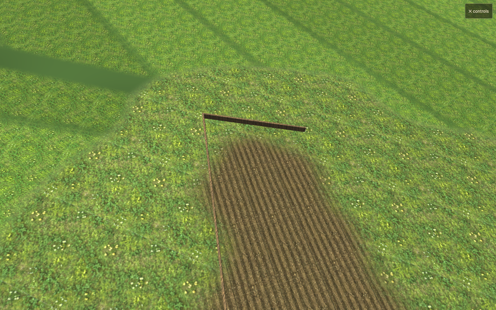
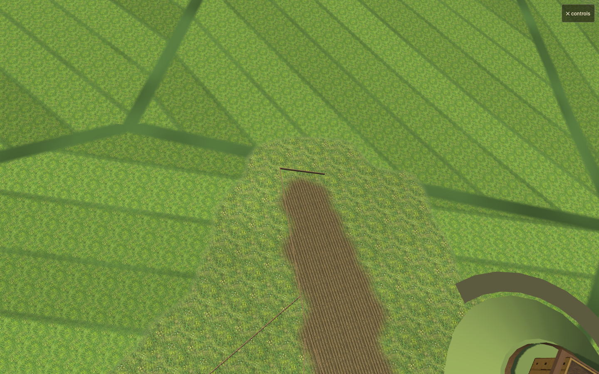

# Garden furrow stability

Baseline `65f5587`. Candidate source hash: `run.json`.

The linearly filtered garden feature texture blended its angle channel with empty neighbours and unlike adjoining parcels. Because furrow UVs used that changing angle, rows curved across a plot and their screen derivatives selected inconsistent mip levels. The visible result was stripes breaking into islands, dots and interference bands.

Bearings now come from the nearest contributing garden texel; only coverage is interpolated. UV gradients project ground derivatives onto the selected fixed bearing, excluding bearing changes at parcel boundaries. The secondary synthetic bed pattern is excluded from actual garden parcels. Existing furrow imagery, parcel geometry, feature textures and simulation records remain in use.

Validation:

- Production GLSL bearing selector rendered against synthetic adjoining plots and empty neighbours. WebGL2 sea/inland and WebGL1 sea: 1,536 pixels select each real heading, 1,024 select empty space, zero select interpolated headings.
- Matched garden views at camera distances 38, 110 and 380, with quarter-pixel pan sequences, plus the existing close/town/realm and river/bridge/woodland views. Evidence: `/tmp/furlong-garden-verified` and `/tmp/furlong-garden-webgl1`.
- `node tools/render-check.mjs --baseline 65f5587 --days 30 --out /tmp/furlong-garden-verified`: all checks pass for sea 1001 and inland 2002; simulation histories, geometry, draw calls, texture counts and texture dimensions match.
- `node tools/render-check.mjs --webgl1 --baseline 65f5587 --days 0 --seeds 1001:sea --out /tmp/furlong-garden-webgl1`: all checks pass.
- Existing texture downsampling tests: 2 pass. Physical mobile performance is unmeasured.

Local review only, branch `codex/texture-filtering`.
