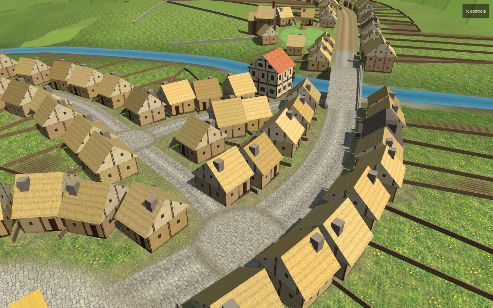
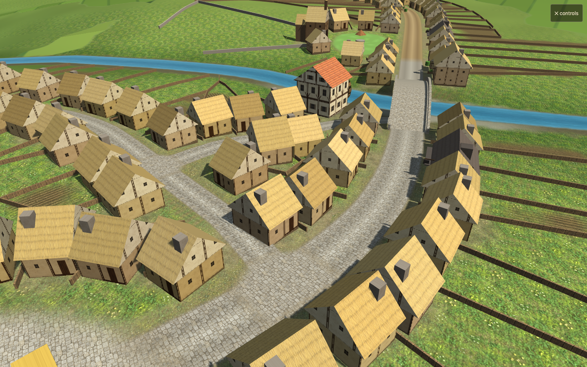

# Continuous street joins

Baseline: `01eaab9`. Candidate source hash: `run.json`.

Street endpoints received both a circular `placeMesh` paving disc and a separate junction overlay. The redundant discs are removed. Repeated endpoint/segment hits are deduplicated by incoming direction before classifying a junction. Two-way joins use a mitred street strip with each approach's actual width, lateral paving/verge profile and longitudinal texture coordinates. Straight continuations remain straight; sharp mitres are bounded. Wider junction patches remain only where at least three distinct branches meet. Existing market squares remain in place.

Validation:

- Four focused geometry tests cover branch deduplication, straight unequal-width joins, right-angle inside corners, rotation and bounded sharp turns. Existing mip filtering tests also pass: six tests total.
- Hardware-backed Chrome WebGL2: sea 1001 / inland 2002, matched paused views and 30-day history hashes. All checks pass, including live road rebuilding, reflective materials, garden bearings, soldier instancing and church variants.
- Geometry decreases by 10,925 triangles in the coastal view and 13,659 inland; draw calls and texture counts/dimensions remain unchanged. `--geometry-budget` checks the candidate stays at or below baseline, rather than requiring identical geometry for this intentional removal.
- Matched close view uses the camera location reported in the user's active seed-1001 tab. The active game was read without reloading or modifying its state. Evidence: `close-*.json` and the images below.
- WebGL1: reported street view and bridge, all checks pass. Evidence: `webgl1-*.json`. Physical-device performance remains unmeasured.

Local review on `codex/texture-filtering`; not merged or deployed.
