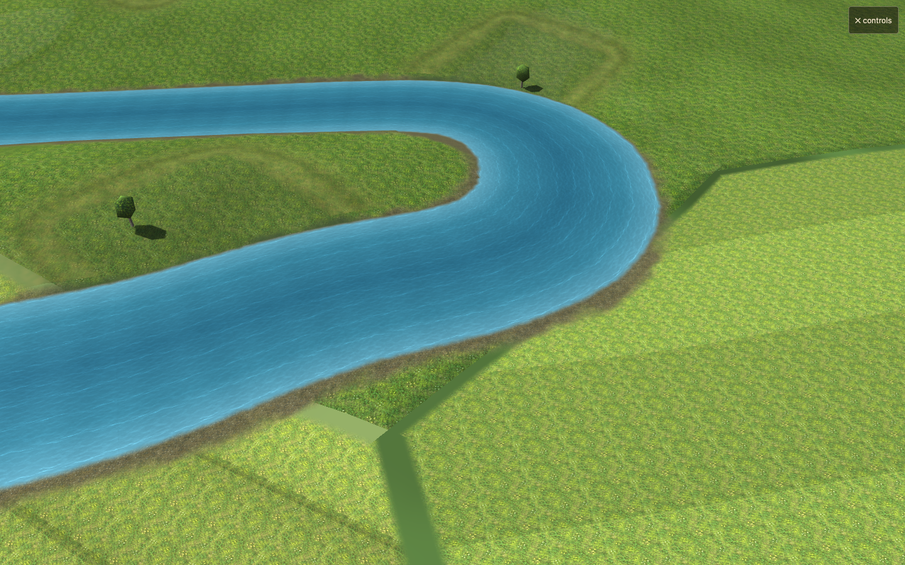
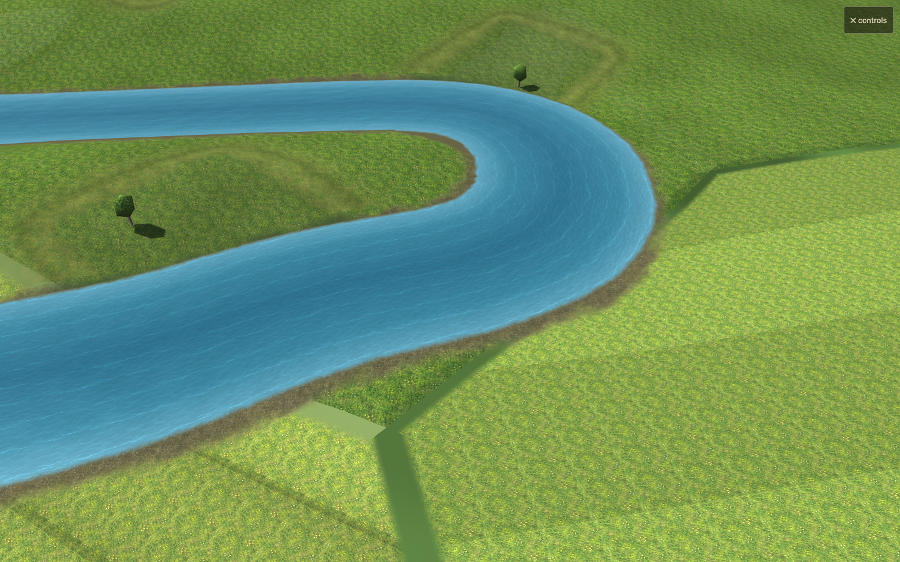
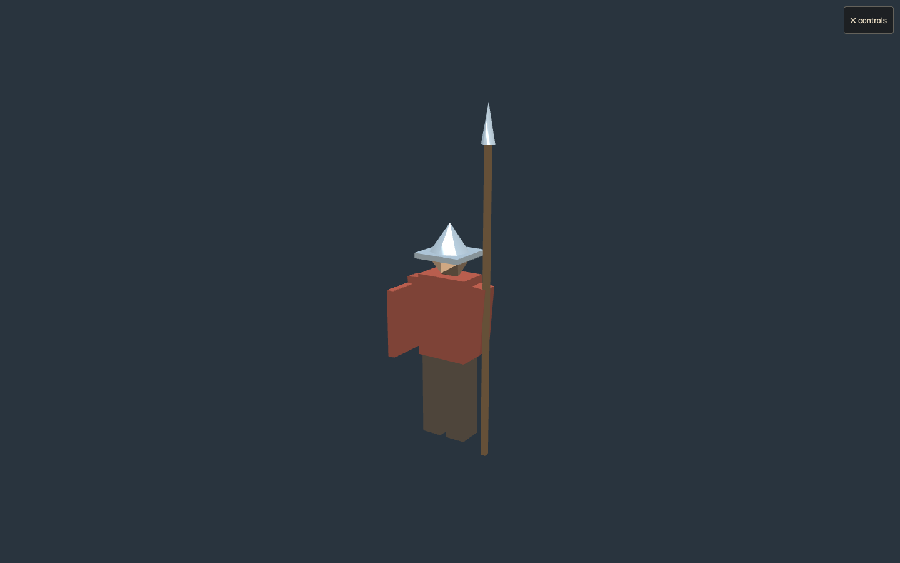

# Surface reflections

Baseline: `96bc17f`. Candidate source SHA-256 and invocation: `run.json`.

Water previously used nearly black specular colours; building and metal batches used Lambert materials with no specular response. Water now reflects the existing sky palette with Schlick Fresnel and catches shadowed sun/torch highlights. Its irregular moving normals follow river tangents and fade with screen footprint and distance. Wet gravel margins retain their matte finish.

Slate roofs, including detail batches, have restrained highlights. Glass is masked to the architectural window panes, excluding mullions, shutters, doors and unglazed cottages; the mask fades before windows become subpixel. Helmet, helmet rim and spearhead carry an explicit iron attribute. Boots, skin, spear shaft, cloth, thatch, timber, plaster and masonry remain matte. Wooden motte roofs no longer inherit the slate finish.

This is sky reflection and direct-light specularity, not a reflection of nearby buildings or boats. It adds no reflection render pass, texture, triangle or draw call. The iron mask adds 1,212 bytes of vertex attributes.

Validation:

- Chrome on the Apple Metal GPU: WebGL2, coastal seed 1001 and inland seed 2002. All checks pass, including actual instanced soldier geometry and both church variants. Matched 30-day history hashes, geometry, draw calls, texture counts and texture dimensions. See `checks.json` and `results.json`.
- Production shaders rendered under unlike sky colours: water, iron, slate and glass respond; timber, thatch and unglazed controls change zero pixels. Water responds more strongly at grazing angles. All 135 iron vertices and 168 other kit vertices have the correct finish. Both WebGL versions pass these probes.
- WebGL1 and a 390 × 844 touch viewport pass compilation, camera uniforms, live rebuilds, garden bearing selection and reflection probes. Evidence: `webgl1-*.json` and `phone-viewport-*.json`. Viewport emulation is not a physical-device performance test.
- Matched garden close/middle/far, fractional pan sequences, street, woodland, river, bridge, town/district/realm; additional water glint, dusk and night captures remain under `/tmp/furlong-reflection-handoff`.
- Median GPU samples across views: coastal candidate 1.88 ms / baseline 1.81 ms; inland candidate 1.70 ms / baseline 1.77 ms. These host-specific samples do not establish device FPS or a speedup.
- Existing texture filtering tests: 2 pass. Shader changes retain the mip/gradient filtering and fixed garden bearings.

Local review on `codex/texture-filtering`; not merged or deployed.
