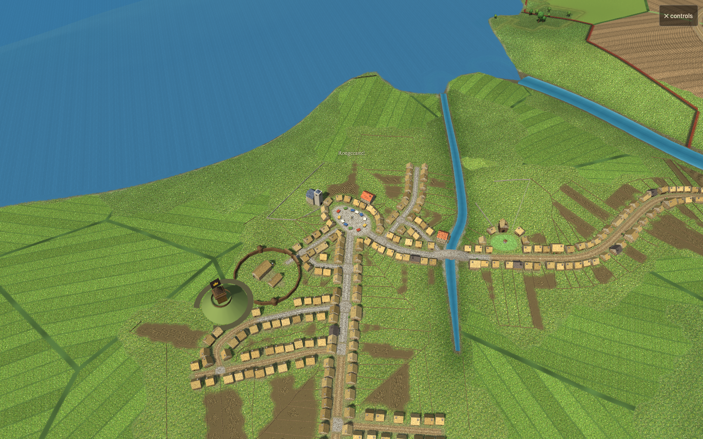
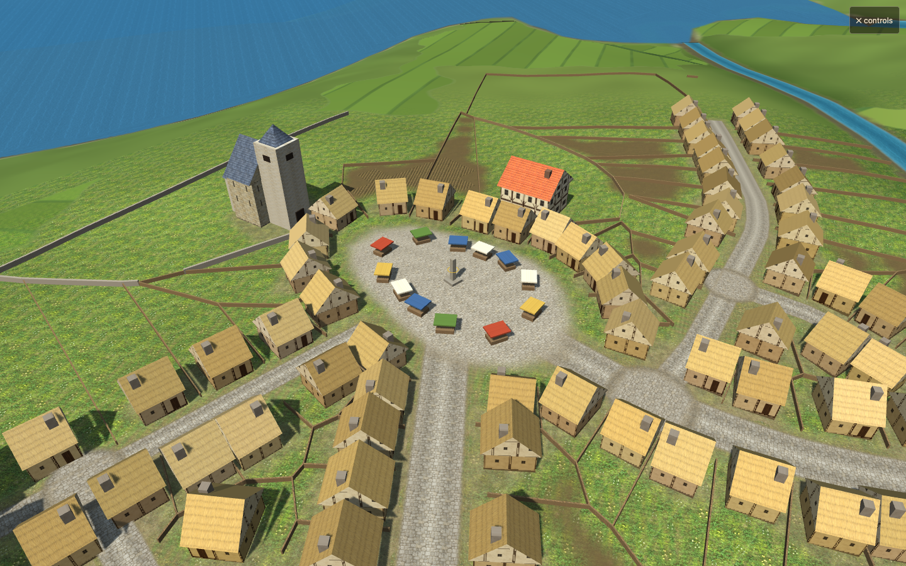
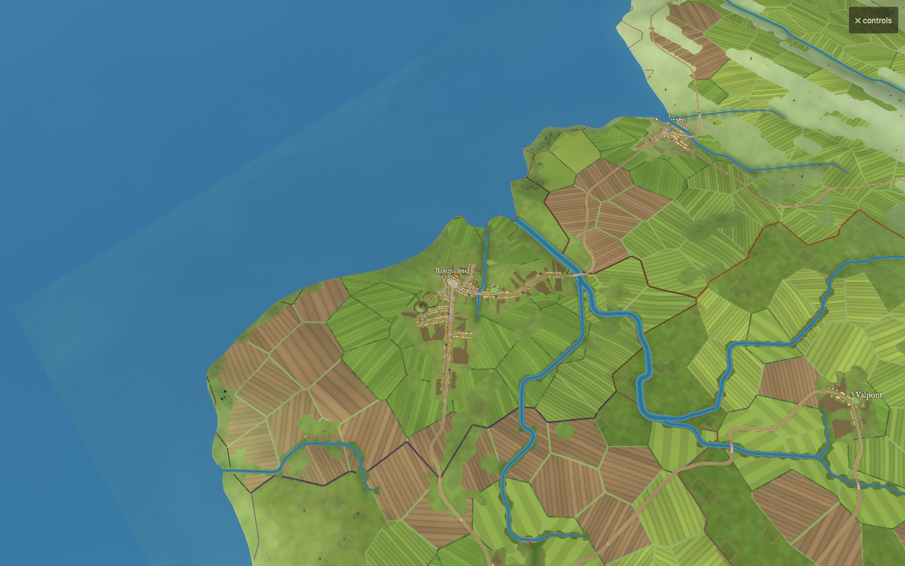

# Texture minification correction

Baseline: main `b264e07785e553f2f0e7e2ba4bdbee81402f0c1f`.
Tested source SHA256 is recorded in `run.json`.

The 512px atlas previously used bilinear sampling without mipmaps. At town zoom, many source texels fell inside one screen pixel and the distance fade retained their unfiltered contrast. Repeating coordinates also require derivatives from the unwrapped UV, otherwise tile seams select a false mip level.

The atlas now has a complete box-filtered mip chain, gradient-based trilinear sampling, a continuous cell inset that protects both sampled levels, and an early fade before an entire material cell becomes subpixel. Procedural noise, rubble, tenant strips, ridges and vine rows lose contrast below their resolvable screen size. Original level-zero pixels and simulation RNG remain untouched. Devices without texture gradients use a conservative detail fade.

Texture count, base dimensions, geometry and draw calls match baseline. The mip chain adds 349,524 GPU bytes (about 0.33 MiB); no new image download is required.

Validation:

- `node --test tools/texture-filtering.test.mjs`: 2 pass. Synthetic adjoining materials remain isolated down to the 4px atlas; alternating grain averages correctly; base pixels and alpha are preserved.
- `node tools/render-check.mjs --baseline b264e07 --days 30 --out /tmp/furlong-filter-verified`: all checks pass for sea 1001 and inland 2002. Actual raster assets loaded, shaders linked, camera uniforms and live rebuilds passed, and 30-day simulation histories matched baseline.
- `node tools/render-check.mjs --webgl1 --baseline b264e07 --days 0 --seeds 1001:sea --out /tmp/furlong-filter-webgl1-verified`: all checks pass.
- Matched close, street, river, bridge, woodland, town, district, farmland and realm views; quarter-pixel pan sequences at the three intermediate distances. Local evidence remains in those output directories.
- Quarter-pixel RGB change RMS over rendered pixels below row 60 decreases 52–84% across six seed/zoom pairs (`pan-metrics.json`). This is a matched motion stability measurement, including geometry motion, not a pure aliasing or FPS measure.
- Hardware Chrome GPU timings were mixed across seeds (sea 1.78ms candidate vs 2.54ms baseline; inland 2.27ms vs 1.83ms). These short samples do not establish a speed improvement or physical-device performance.

The render harness now serves snapshot HTML and assets over loopback HTTP, awaits image readiness, and captures intermediate zooms and pans. This prevents the prior file-origin/absent-asset failure from silently excluding real material textures.

Before and after town views:

Close detail:

Far view:

Local test worktree: `codex/texture-filtering`, preview `http://127.0.0.1:8766/#s=1001&f=1001&c=sea`.
