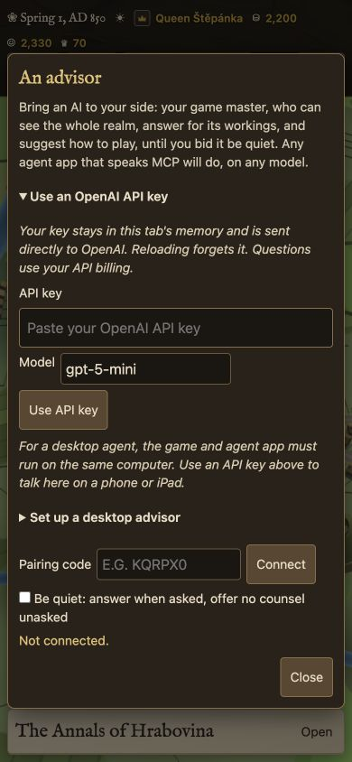
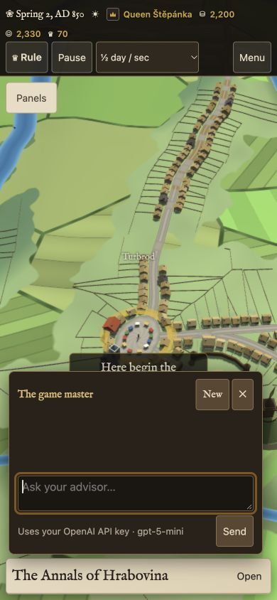

# Advisor API-key option

The existing advisor now accepts an OpenAI API key outside Claude artifacts. Claude artifacts still use their native `sample` capability automatically. The advisor retains its persona, current realm context, history, Markdown links and existing game tools.

- Advisor offers a masked key field and editable model, defaulting to `gpt-5-mini`.
- The key is held in a closure in this tab only; configuration clears the field. It is absent from game saves, browser storage and model messages. Disconnect removes the adapter; reload forgets it.
- Requests go directly to the fixed OpenAI Responses endpoint, without browser cookies or redirects. OpenAI API billing applies. Responses use `store:false`.
- Tool calls return current game results, preserve reasoning context, and stop at a bounded step count. Stop prevents subsequent game actions. There are no automatic retries.
- Invalid keys, inaccessible models, quota errors, incomplete responses and network failures have visible errors. Provider error text cannot echo the key into the page.

## Checks

`node --test tools/advisor-api.test.mjs`: eight tests pass, covering request construction, key isolation, game-tool round trips, malformed/unknown tools, status errors, cancellation, incomplete/refused responses, loop bounds, and native Claude initialization.

Browser checks at 390×844, 820×1180 and 1440×900: no horizontal overflow; password field is 44px tall; API setup opens the existing chat and focuses its message field; the setup field clears; disconnect removes key-backed chat; reload removes configuration. A live request with a deliberately invalid test key reached OpenAI and displayed the expected rejection. No valid-key inference was performed.

OpenAI's endpoint returned CORS permission for the Site origin and the required authorization/content-type headers. JavaScript syntax and diff whitespace checks passed.

