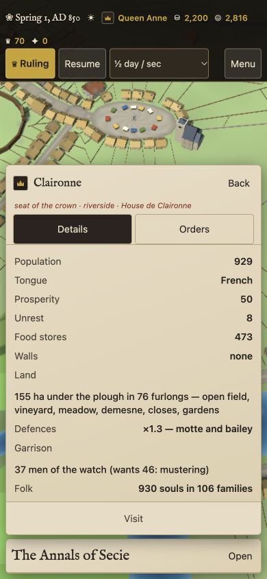
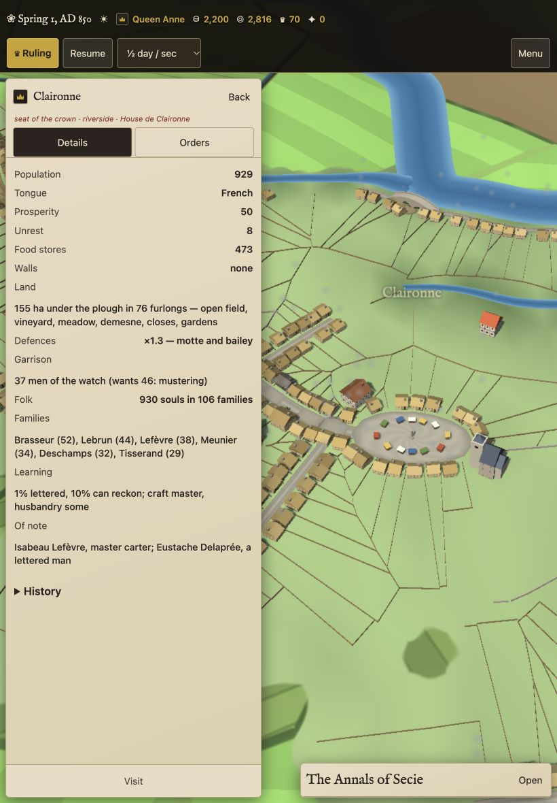
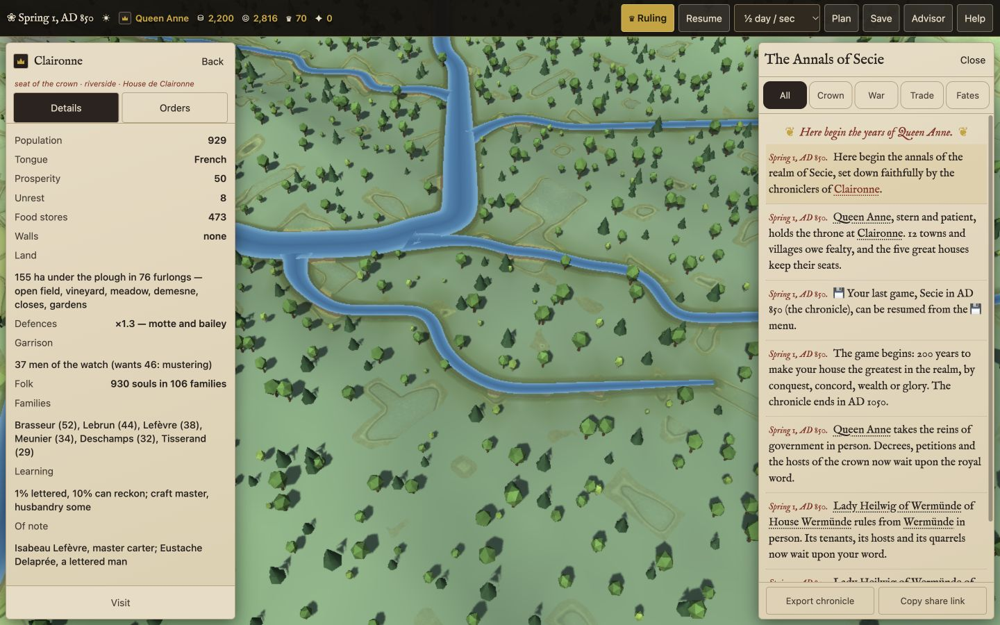
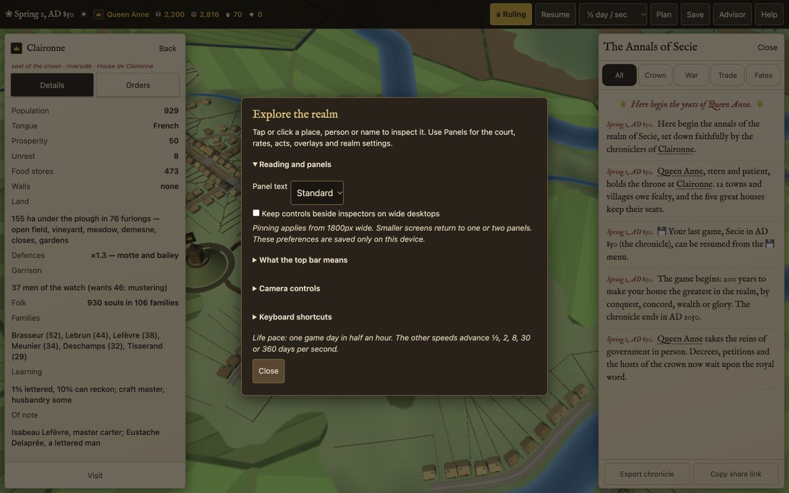
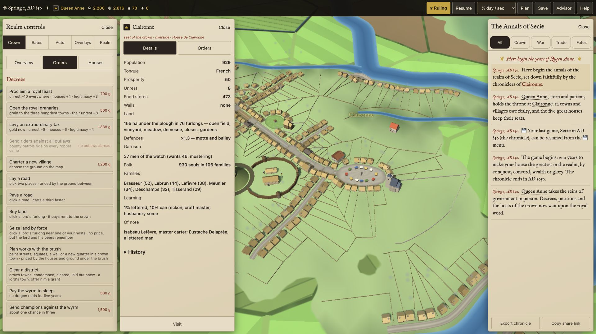

# Responsive UI fixes

Implemented in `index.html`, preserving the single-file application and simulation rules. The commit is based on `origin/main` at `3b2eaed`; the working branch's three unrelated simulation commits are excluded.

## Changes

- Opaque, readable HUD; Pause/Resume and named speeds. Phone and tablet utilities move into Menu.
- Separate phone, tablet and desktop layouts. Compact screens show one substantial panel; phone drawers use shorter bottom sheets. Desktop inspectors replace the left dock and can coexist with Annals. Back restores an open control panel.
- Panels follow the measured HUD height. Collapsed Annals stay at the bottom; legends no longer stretch vertically. Resizing reconciles the active panels.
- Court views separate Overview, Orders and Houses, for crown and house play. Larger text and darker notes clarify objectives and relationships.
- Inspector headers, Details/Orders navigation and Visit remain outside the scrolling content. History uses a disclosure.
- Edge-docked planner with explicit Pan and brush states. Map placement has a visible Cancel button.
- Help explains touch gestures, shortcuts, camera modes and every HUD metric without hover. Standard/Larger panel text is saved locally; optional court pinning applies at 1800px or wider and collapses automatically below that width. Reduced-motion preferences stop the automatic opening camera and remove easing.
- Native tab buttons, arrow-key navigation, pressed/expanded states, keyboard-operable names and rows, and inert closed panels.
- Save, Advisor and endgame dialogs contain keyboard focus, isolate background controls, close with Escape and restore focus. Dialog bounds follow the visible viewport as it resizes. Save notes have readable contrast; file import has a native button.
- Advisor setup is disclosed progressively, with its same-computer requirement stated upfront. Folded petitions remain reachable through Menu.

## Review coverage

All seven mobile priorities and all seven wider-screen priorities are implemented:

| Review recommendation | Implementation |
| --- | --- |
| Phone toolbar, labelled speeds, contrast and targets | Opaque HUD, Pause/Resume, named selector, utility Menu, coarse-pointer targets |
| Save readability and accessibility | Light notes, native import, semantic dialogs and managed focus |
| Phone navigation and map space | Shorter sheets; Overview/Orders/Houses; pinned inspector header and Visit; expandable history |
| Landscape and tablet placement | Shared viewport/pointer layout; measured HUD; bottom-anchored collapsed Annals |
| Tablet legend and reading width | Natural collapsed height, dark labels, bounded side docks |
| Desktop obstruction and camera focus | Two substantive panels by default, Back, optional wide-screen pinning, unobscured camera centre |
| Typography and controls | Larger readable text, locally saved text preference, labelled Help and camera instructions |
| Planning | Edge dock, 44px brushes, explicit Pan, selected state, Done and placement Cancel |
| Advisor entry | Secondary menu, same-computer requirement upfront, expandable setup |
| Keyboard and assistive controls | Native tabs, arrow keys, accessible states, named buttons, inert closed panels |
| Additional captured-flow findings | Non-hover metric explanations, dismissible mobile gesture primer, menu-based export/share |

## Verification

Rendered the local app in the Codex browser with coarse-pointer emulation for phone/tablet checks:

| Layout | Viewports |
| --- | --- |
| Phone | 320×568, 390×844, 844×390 |
| Tablet | 820×1180, 1024×768, 1180×820, 1366×1024 |
| Desktop | 1280×800, 1440×900, 1920×1080 |

No horizontal overflow in the measured matrix. Inspector close controls measure 44px high; Visit measures 48px. Desktop map width between inspector and Annals measures 614px, 753px and 1,194px respectively. See `responsive-matrix.json` and `desktop-matrix.json`.

Checked crown and house Overview/Orders/Houses views and tab arrow keys, inspector Orders, Annals/inspector opening in both directions, Back, live desktop-to-tablet resizing, planner Pan/brush switching and navigation away from the planner. A relief order produced its chronicle entry and disabled its button for the cooldown.

Larger text persisted through reload. Optional pinning displayed court, inspector and Annals at 1920px, then collapsed court at 1440px. The 390px phone drawer left map space above its sheet. Save fitted a shortened 390×400 viewport. Save focus wraps in both directions. Escape restores Menu focus and clears background inertness. Advisor setup remains collapsed initially. Browser console checks reported no errors or warnings. JavaScript syntax and `git diff --check` passed.

Physical iPhone/iPad Safari, software-keyboard behavior and external advisor pairing remain unverified. No deployment was performed. Unrelated README and soak-test work was preserved.

## Screenshots

### Phone

### iPad

### Desktop

Additional screenshots cover phone landscape, court orders, planner, Save and the landscape iPad legend.

