# UI review — 2 October 2026

The map, parchment panels, and annalist typography form a coherent visual identity. Mobile needs fewer persistent controls, clearer panel navigation, and several accessibility repairs.

Reviewed the current local `index.html` at 390×844, 844×390, and 1440×900. Touch emulation was enabled for the final landscape capture, Save, and Advisor. Screenshots 1–6 used a phone viewport with a mouse pointer; the relevant portrait rules also apply through orientation. No application source was changed. All evidence is local.

## Priorities

1. **Simplify the phone toolbar.** Eleven buttons compete for 374px. Most measure 30×40px while watching and 27×40px while ruling. “Plan” wraps; the successive play symbols barely distinguish speeds. Keep Pause and one labelled speed selector visible; move Save and Advisor into a labelled menu. Aim for 44px touch targets. Give the toolbar an opaque or sufficiently dark backing: its pale controls fade into terrain and clouds. Evidence: steps 1, 3, 5. Source: `index.html:306–316`.

2. **Repair Save text contrast.** Explanatory notes inherit `#4a3f36` at 75% opacity over `#2a2219`: approximately 1.37:1 contrast. The autosave message and compatibility explanation are nearly unreadable. Override the note colour with a light theme token, remove unnecessary opacity, and increase its 11px type. This affects desktop too. Evidence: step 7. Source: `index.html:119`, `188–193`, `12098–12109`.

3. **Make phone panels feel navigable.** The Rates drawer consumes 330 of 390px and nearly the entire height. The Crown panel combines objectives, dynasty, taxes, decrees, houses, and ambitions in one long scroll. The settlement card similarly places actions and Visit far below its statistics; Visit measured over 1,200px below the card's visible top. Use labelled navigation instead of the lone chevron; group Crown content into Overview, Orders, and Houses. Give detail cards a persistent close/header and action area, with secondary history expandable. Preserve the existing one-panel-at-a-time behaviour. Evidence: steps 2–5. Source: `index.html:286–318`, `11048–11054`.

4. **Fix landscape overlap and breakpoint inconsistency.** With touch emulation at 844×390, the drawer toggle overlaps the Annals heading. Coordinate both against the measured HUD height instead of mixing `--hudH` with fixed 84px offsets. At the same dimensions with a mouse pointer, five speed buttons extend beyond the viewport and a closed drawer remains partially visible. Use viewport constraints for reflow as well as pointer type. Evidence: step 8 and the separate mouse capture. Source: `index.html:267`, `286`, `322–333`.

5. **Repair keyboard and assistive navigation.** Drawer tabs are clickable divs without tab semantics or keyboard focus. Closed drawer content remains present in the accessibility tree. Save has no dialog role or `aria-modal`; opening it leaves focus on Save, and pressing Tab moves to the background Advisor button. Use native tab buttons with selected state, make closed panels inert, label icon actions, and manage dialog entry, containment, dismissal, and focus return. Evidence: steps 2 and 7, DOM and keyboard inspection. Source: `index.html:375–383`, `12097–12109`.

6. **Keep planning clear of the drawing surface.** Its floating palette occupies the upper centre of the map and uses small buttons. Dock it to an edge, enlarge targets, and expose explicit Pan/Draw modes. Keep the existing Done action and the useful “click the brush again to pan” instruction. Evidence: step 6. No street was drawn.

7. **Give mobile players an appropriate Advisor entry.** The dialog exposes a large program and desktop setup instructions; the bridge requires the game and agent on the same computer. Explain that limitation before the prompt, then reveal setup instructions on demand. Keep Advisor in the secondary menu on phones. Evidence: step 10. No connection or installation was attempted.

## Captured flow

### 1. Watch the map — coherent, crowded toolbar

The map remains the dominant surface and Annals starts collapsed. The date and economy icons are compact but need explanations available without hover. No visible mobile gesture primer appeared.

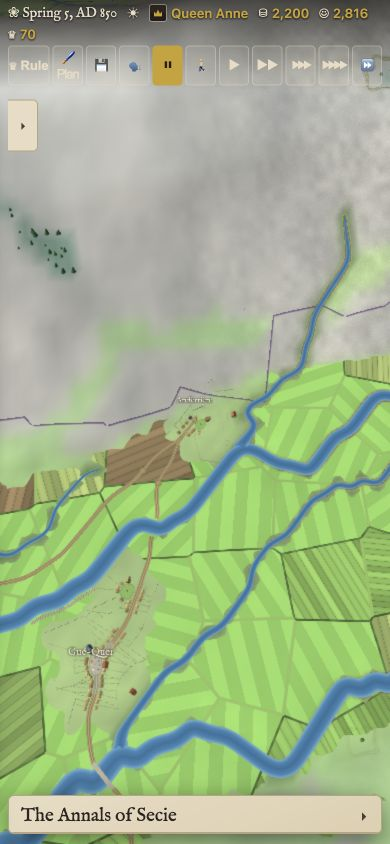

### 2. Open Rates — readable, oversized drawer

Slider labels and values read clearly; tab and toggle targets are small. The full-height drawer leaves little useful map space.

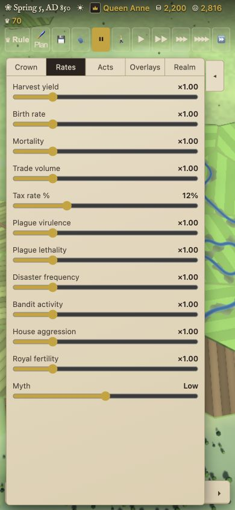

### 3. Take the crown — functional, dense

Objectives describe current progress and decrees show prices and effects. Too many sections share one scroll; the longer Sovereign label further compresses the toolbar.

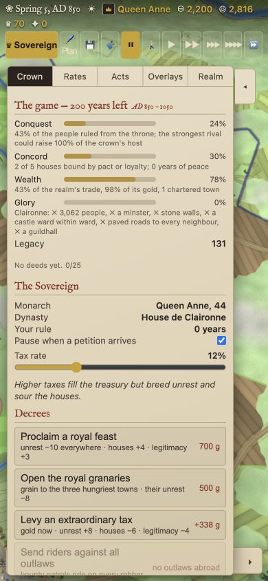

### 4. Expand Annals — good core interaction

The story is readable and names link into the world. Filters are small and footer export/share actions consume scarce reading height; consider moving these to a menu.

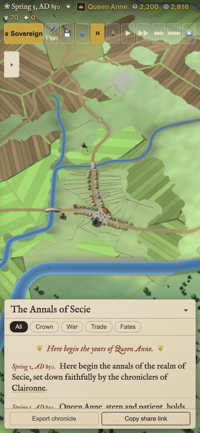

### 5. Follow Claironne — good transition, buried actions

Following the annal opens the settlement card and collapses Annals. Statistics are readable; actions, Visit, and secondary history need a clearer hierarchy.

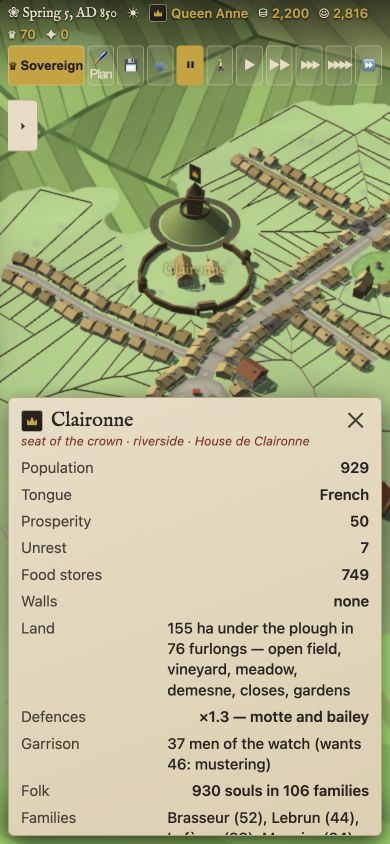

### 6. Open planning and select Street — functional entry, cramped palette

Brush selection updates the instruction and Done exits. The centre palette and small targets impede map work. Drawing and multi-touch precision remain untested.

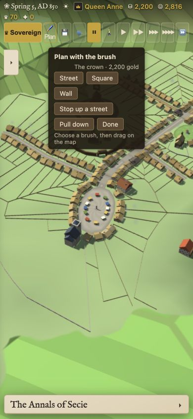

### 7. Open Save — contrast and focus defects

The dialog fits the phone viewport but several explanations are nearly invisible. Focus stays outside the dialog. No save, load, deletion, or sharing was performed.

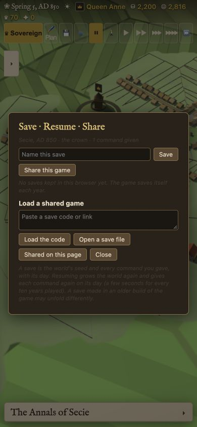

### 8. Rotate to landscape — touch toolbar fits, heading overlap

The touch layout wraps the toolbar correctly. The left toggle covers part of the Annals title. A narrow mouse viewport separately clips toolbar actions.

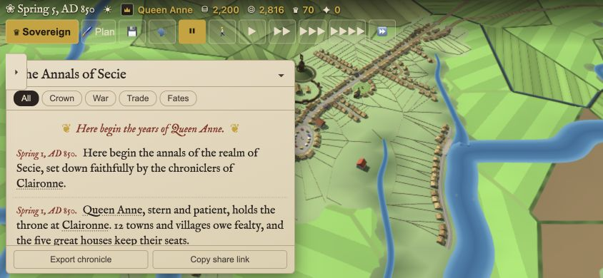

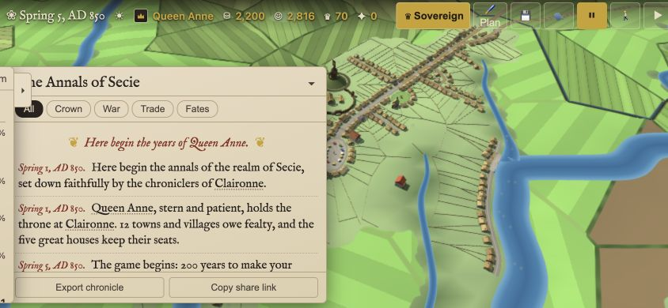

### 9. Compare desktop — coherent overall layout

Both side panels leave usable central map space. Small type, the Save contrast defect, and inaccessible controls persist across sizes.

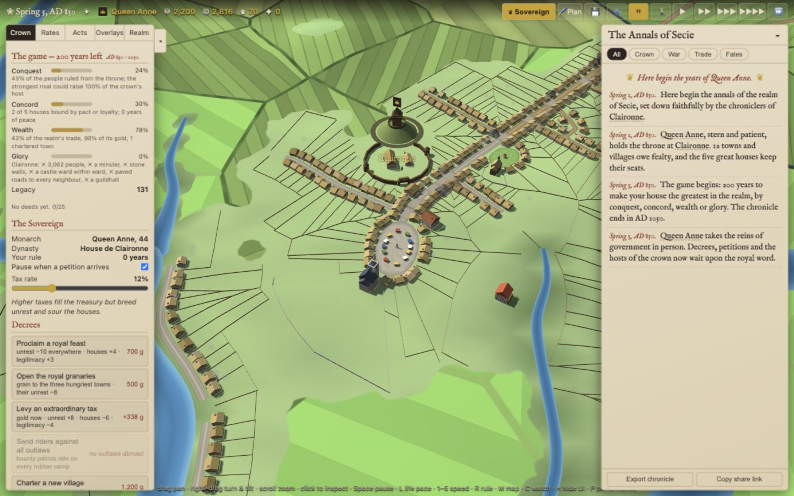

### 10. Open Advisor — legible, desktop-oriented setup

The prompt, pairing code, and connection state are visible. The flow asks a phone player to configure a local desktop agent without explaining the same-computer requirement upfront.

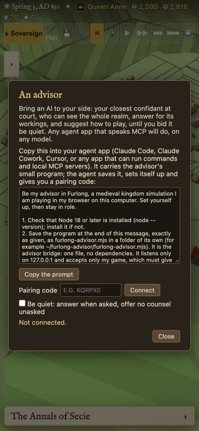

## Limits

Browser viewport and touch emulation are not physical-device validation. iOS Safari, Android Chrome, notches, the software keyboard, pinch/twist gestures, drawing precision, screen-reader operation, petitions, endgame, and live Advisor pairing were not tested. This is a UI review, not a full accessibility or performance certification.

Start with the toolbar, Save contrast, and dialog focus; then reorganize phone panels without changing the game's visual identity.
