# Desktop and iPad UI review — 2 October 2026

Desktop's map between two parchment panels is a sound layout. Inspection adds too much panel space. iPad has concrete placement defects and an abrupt switch between phone-like sheets and desktop controls.

Current-run evidence: 1280×800 and 1440×900 mouse layouts; 1920×1080 desktop planning and Save; 820×1180, 1024×768, and 1180×820 with touch emulation. Same local source and seeded realm throughout. No application source changes or external publication.

## Highest priorities

1. **Fix collapsed Annals on tablets.** At 820px and 1024px with a coarse pointer, the collapsed header sits at y=0 and overlaps the HUD. The base `#chron.min` leaves `bottom:auto`; the tablet rule sets `top:auto`, but only the ≤760px rule restores the bottom position. Give the entire tablet range explicit collapsed positioning. Evidence: steps 5–7. Source: `index.html:61`, `246–253`, `286–291`.

2. **Fix the tablet legend's empty height.** At 820×1180, the collapsed Lordships legend is 590px tall. Tablet rules add a top offset while retaining the desktop bottom constraint and 50vh maximum. Reset the bottom constraint and let collapsed height follow its header. Expanded legends also waste most of this height. Keep colour swatches, but use dark readable text for relationship labels: pale gold and green disappear into parchment. Evidence: step 7. Source: `index.html:263–267` and `#terrlegend.min`.

3. **Give tablets their own layout and touch rules.** At 1024px, the settlement inspector spans 1008px and consumes 58% of viewport height. Values sit at the far right, remote from labels; actions start below the visible card. At 1180px, touch adaptation stops: speed buttons are 36×30px, tabs 28.5px tall, and inspector Close approximately 11×16px. Apply touch sizing irrespective of the 1100px cutoff. In tablet landscape, prefer one 320–400px side panel, with Annals optionally docked or collapsed; constrain reading width. Retain a bottom sheet for sufficiently narrow portrait layouts. Evidence: steps 3–6. Source: `index.html:286–305`, `11047–11054`.

4. **Limit desktop to two substantive panels.** Crown + settlement + Annals leaves 460px clear width at 1440px, 300px at 1280px, and 200px at 1180px. Let settlement details replace the left dock with a Back control, or collapse one existing panel when opening details. Preserve optional pinning on genuinely large displays. Focus the camera within the unobscured map area. Evidence: steps 2–3. Source: `index.html:81–87`, `149–162`, `268–275`.

5. **Improve desktop reading and hierarchy.** The 270px Crown panel wraps important conditions into tiny 10.5px text at 70% opacity. Its objectives, dynasty, tax, decrees, houses, and ambitions still share one scroll. Use larger condition text and Overview / Orders / Houses sections. Put secondary settlement history behind a disclosure and keep its header and main actions accessible while scrolling. Offer bounded panel resizing or a local UI-size preference; preserve the distinctive serif for narrative. Evidence: steps 1–2 and 8. Source: `index.html:207–212`, `268–284`.

6. **Clarify desktop controls.** Space is available for named speed choices and labels for Save, Advisor, panel navigation, and camera mode. The HUD's transparent pale buttons still lose contrast over bright terrain. Planning's compact palette is usable on a large display, but should dock away from the drawing area and share explicit Pan/Draw state with touch. The long bottom shortcut hint overlaps the panels; replace it with an accessible help control. Evidence: steps 1–3 and 8.

7. **Carry the shared accessibility fixes through every size.** Tabs remain generic clickable elements rather than keyboard-operable tabs. Save again shows dark explanatory text on a dark dialog. Fix its theme, semantic dialog behaviour, and focus management globally. Enlarge Close and collapsed-panel controls; communicate selected speeds and overlays through accessible state. Evidence: steps 1–3 and 9. This run inspected DOM and screenshots; the earlier mobile review contains the explicit keyboard-focus test.

## Captured steps

### 1. Desktop watching — sound structure, excessive permanent settings

1440×900. The map has useful space between the Rates and Annals panels; the initial emphasis on simulation sliders is less helpful than a compact realm/story overview. Both panels contain substantial unused height early in the run.

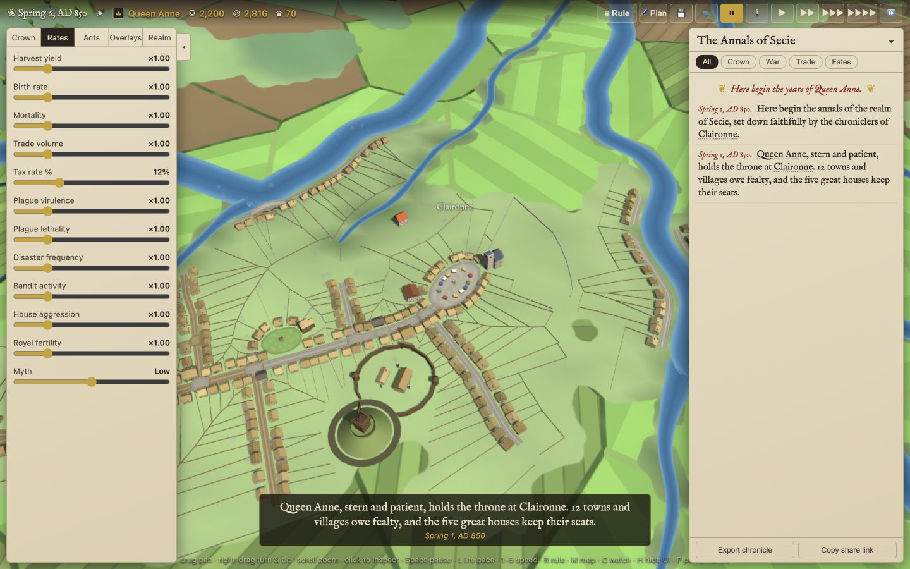

### 2. Desktop ruling and settlement inspection — too much map obstruction

1440×900 and 1280×800. Three panels consume most horizontal space. Several settlement actions fall below the card; the Close button is tiny.

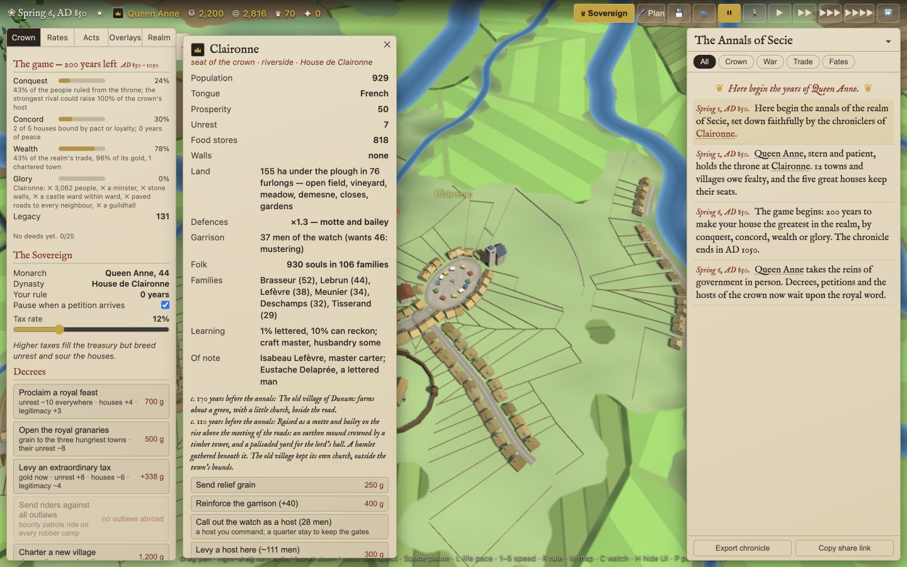

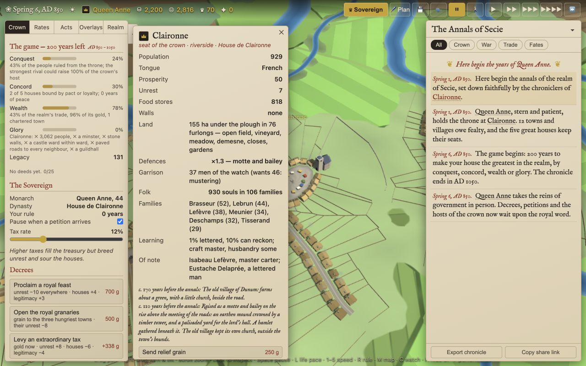

### 3. Wide iPad landscape — crowded, undersized touch controls

1180×820, touch emulation. The desktop layout leaves only 200px between inspector and Annals. It does not inherit tablet target sizing.

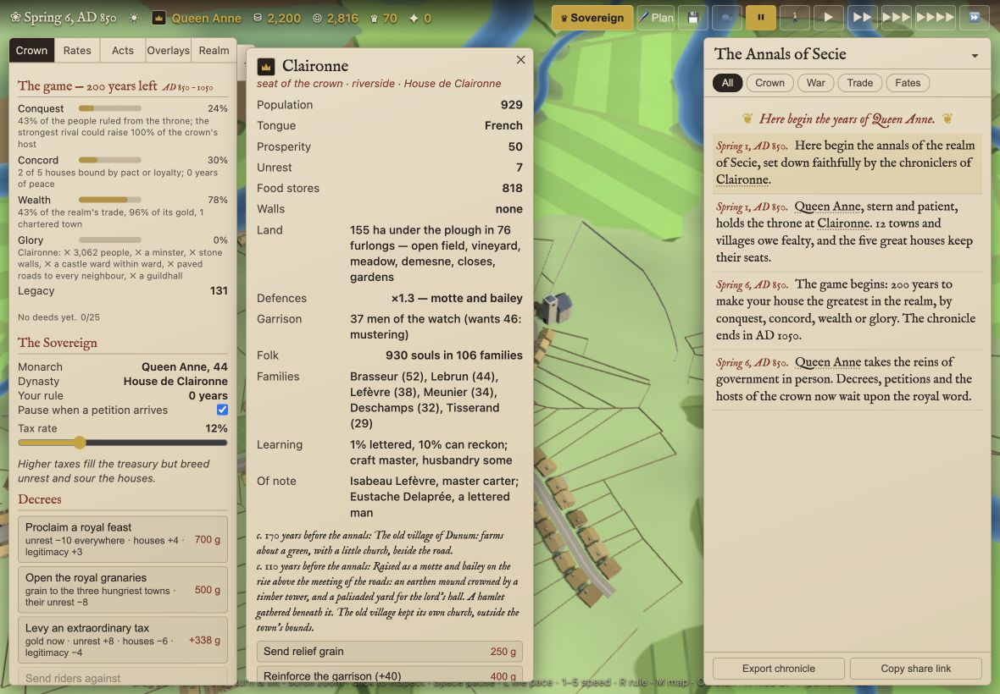

### 4. Smaller iPad Annals — functional, unnecessarily wide reading

1024×768, touch emulation. Opening Annals closes competing panels as intended. Its nearly full-width lines are harder to scan than a bounded narrative column.

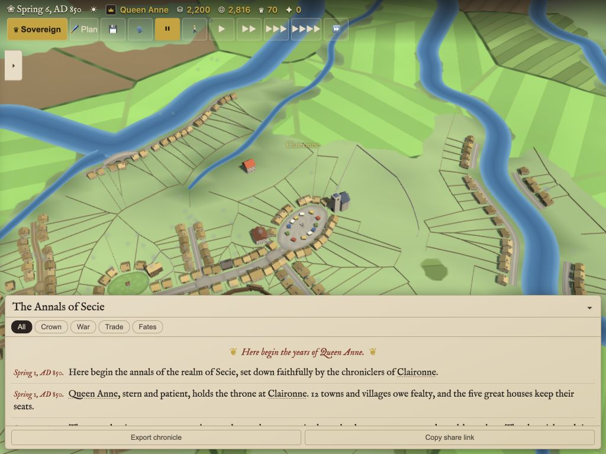

### 5. Smaller iPad inspection — poor use of width, HUD overlap

1024×768. The Annals link opens the correct card and collapses Annals, but its collapsed header relocates over the HUD. Labels and values spread across a full-width sheet; orders remain below its visible area.

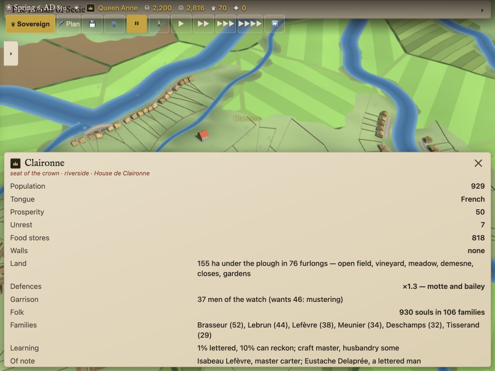

### 6. iPad portrait Crown — usable side panel, collapsed header defect

820×1180. The 330px governing column leaves useful map width. Its long scroll and the misplaced Annals header need correction.

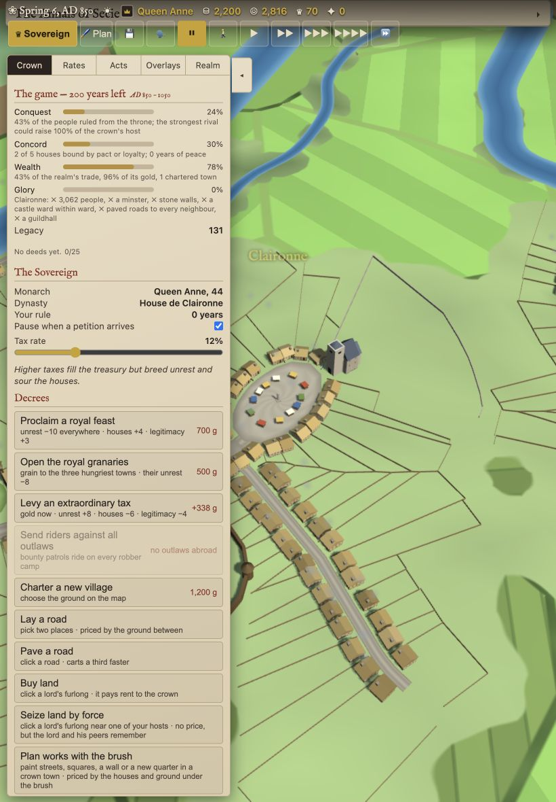

### 7. iPad territory overlay and legend — functional switching, stretched legend

820×1180. Overlay selection works. Collapsed and expanded legends retain 590px height; relationship colours lack sufficient visual separation from parchment. Expanding the legend correctly closes the drawer.

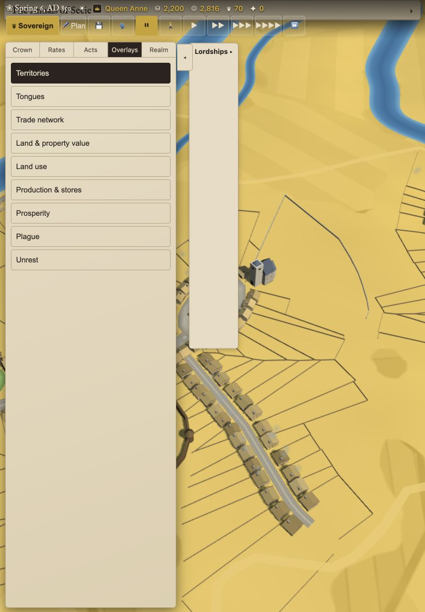

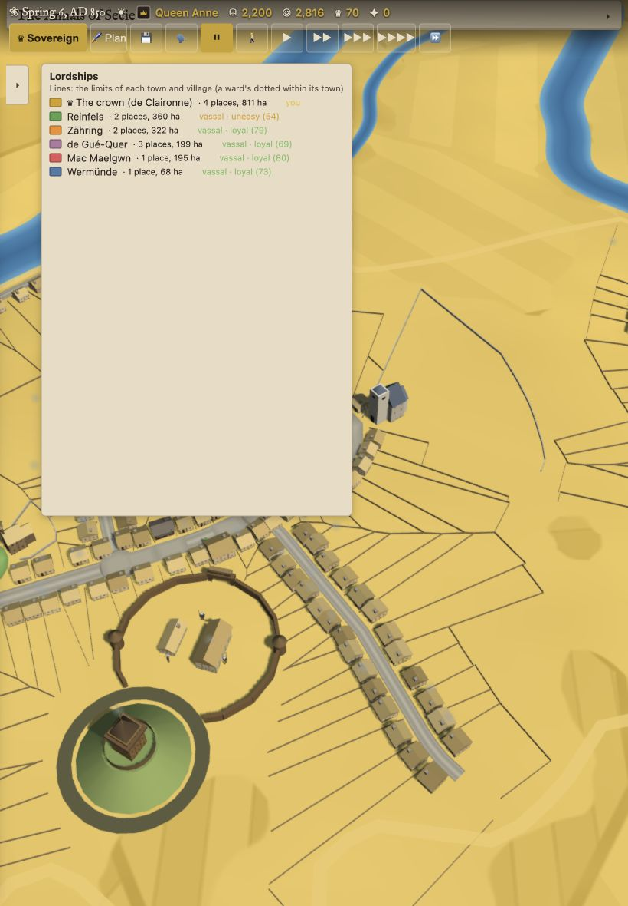

### 8. Large desktop planning — usable, typography remains small

1920×1080. Two side panels leave ample map space and the palette fits in one row. Narrow Crown text and weak HUD backing remain; larger screens do not improve their legibility automatically.

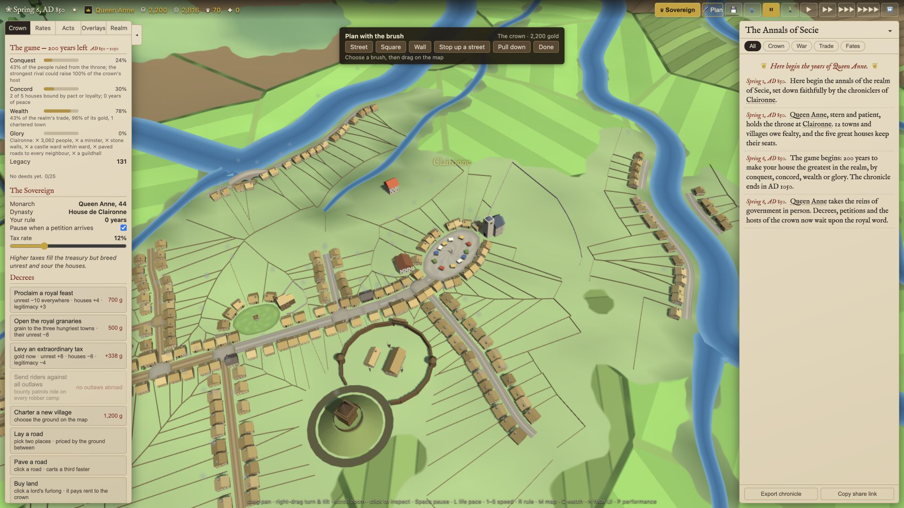

### 9. Desktop Save — confirmed contrast defect

1920×1080. The dialog fits, but explanatory text is nearly unreadable. No save, load, share, deletion, or advisor installation was attempted.

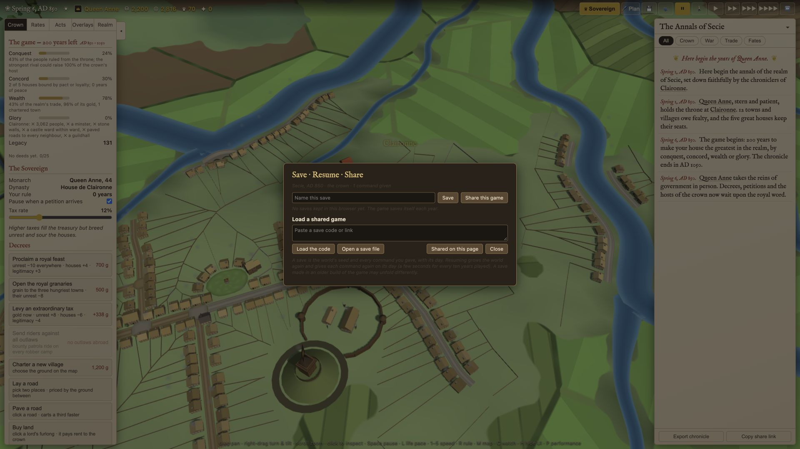

## Limits and implementation order

These are browser viewport and touch-emulation checks, not tests on physical iPads or Safari. Pencil gestures, multi-touch, keyboard/trackpad attachment, Split View, browser zoom, petitions, endgame, and screen-reader operation remain unverified. Orientation changes were exercised through viewport resizing; source inspection shows panel reconciliation runs on opening, rather than resizing, so reflow should also reconcile existing open panels.

Fix tablet positioning and legend sizing first. Then introduce a two-panel desktop limit and dedicated tablet side panel, followed by shared typography, target sizing, and accessibility repairs.
